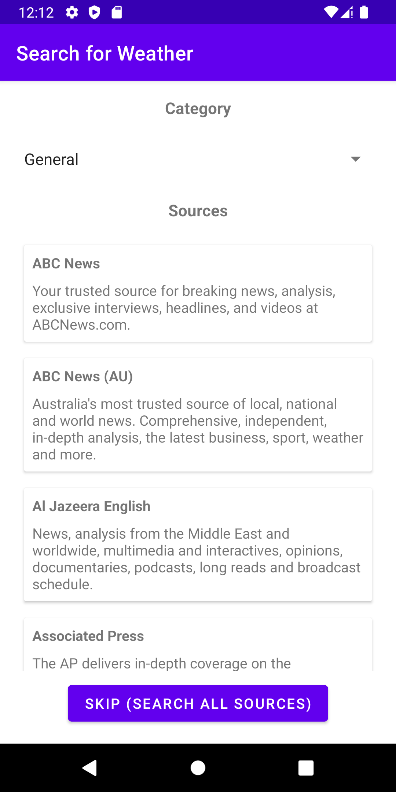
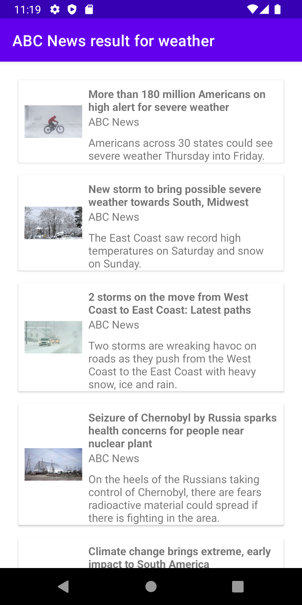

# Android News
Android News is a simple app to aggregate news from multiple sources. It can be used to view top headlines for broad categories, perform specific term searches, view news from specific sources, and view local news in different areas of the world!

# Screenshots
Home | Source | Search | Maps |
:-------------------------:|:-------------------------:|:-------------------------:|:-------------------------:|
 |  |  | 

# API
+ Everything News API
+ Top Headlines News API

# Author
- Name: Ramim 
- Github: [https://github.com/rameme](https://github.com/rameme)